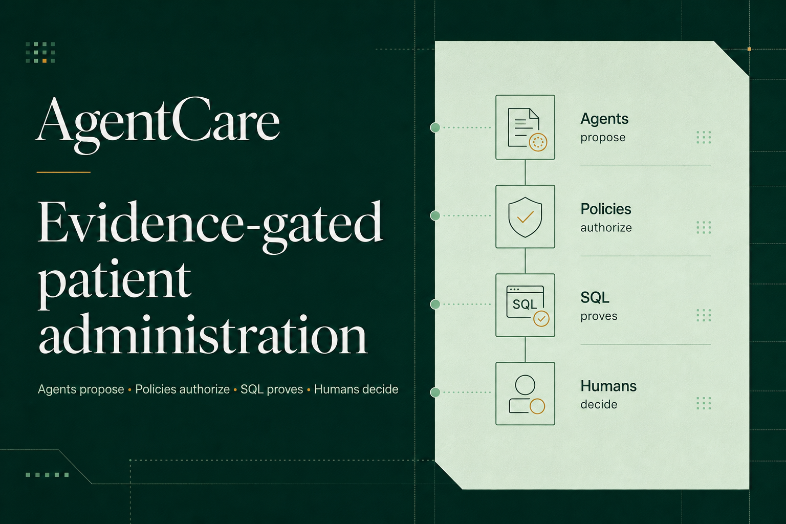
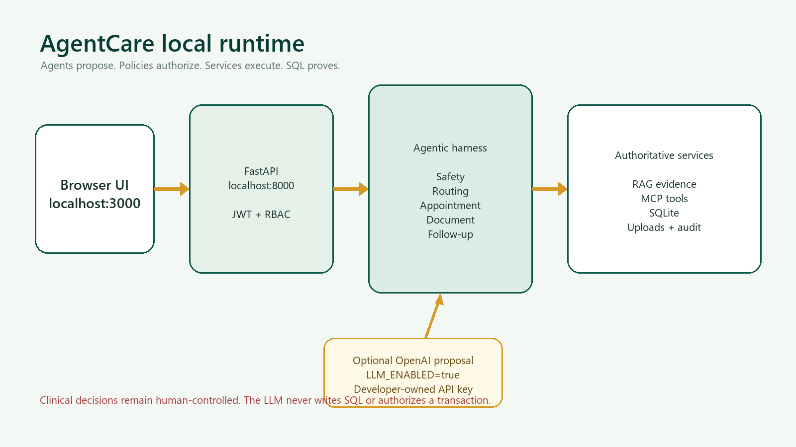
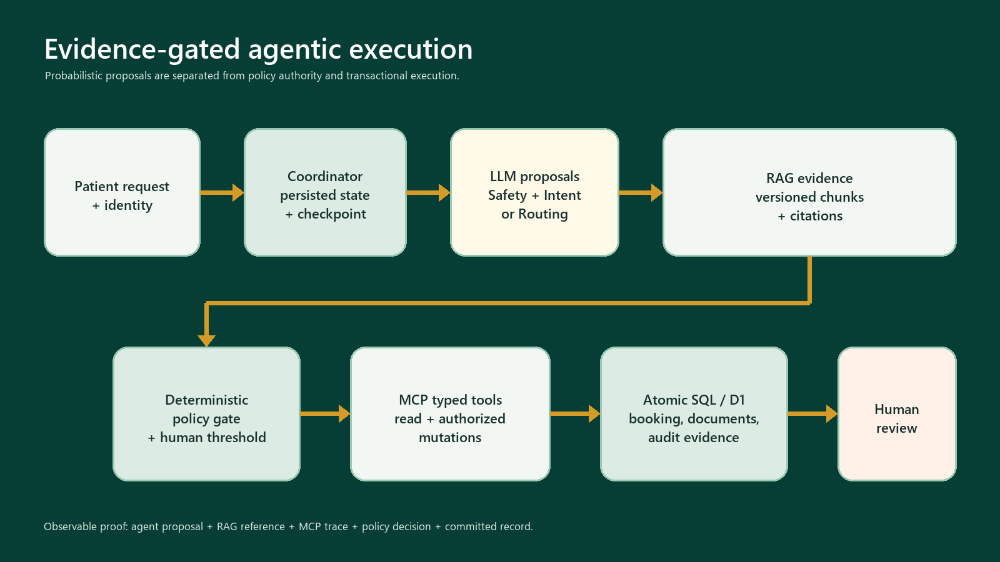
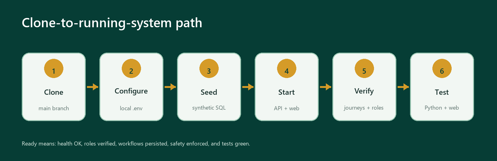

# AgentCare Local Setup Guide



This guide is for a developer, evaluator, or collaborator who clones the
AgentCare repository and wants to run the complete application locally. It
covers the recommended Docker route, a native development route, optional
OpenAI LLM configuration, synthetic accounts, verification, tests, updates,
reset procedures, and common problems.

Download the print-ready version:
[AgentCare Local Setup Guide (PDF)](../output/pdf/AgentCare_Local_Setup_Guide.pdf).

## 1. What a new developer needs

Choose one of these paths:

| Path | Required software | Best for |
|---|---|---|
| Docker - recommended | Git and Docker Desktop with Docker Compose | Fastest complete startup with isolated dependencies |
| Native development | Git, Python 3.11 or 3.12, Node.js 22.13+, and pnpm 11.9 | Editing, debugging, and running services separately |

The following are optional:

- An OpenAI API key with active billing/quota, only if real LLM proposals are
  required.
- An editor such as VS Code.
- A PDF or text file containing synthetic, non-sensitive content for document
  workflow testing.

No OpenAI key is required to exercise the full safe-fallback workflow. Without
a key, deterministic policies, RAG retrieval, MCP tools, SQL persistence,
human review, booking, documents, and audit evidence still run.

## 2. Local architecture



The browser uses the web interface on port `3000`. During local development,
the interface calls the FastAPI service on port `8000`. The backend owns JWT
authentication, role and patient ownership checks, agents, approved-policy
RAG, MCP-style hospital tools, SQLite transactions, uploads, and audit events.
Only bounded agent proposals may use OpenAI. Policies and services remain
authoritative.

## 2A. Why this is an agentic AI project



AgentCare is not a single chatbot prompt wrapped around an appointment form.
It is a persisted, evidence-gated multi-agent workflow:

1. The **Coordinator Agent** creates or resumes a durable workflow, selects the
   next checkpoint, passes minimum necessary state, and never skips a paused
   approval.
2. The **Safety Agent** evaluates emergency and prohibited clinical language.
   A deterministic safety policy remains authoritative even when an LLM
   proposal is available.
3. The hosted **Intent Agent** classifies `book`, `reschedule`, `cancel`, or a
   safety-boundary intent. The Python path performs the same administrative
   intent checkpoint inside its orchestrator.
4. The **Department Routing Agent** retrieves approved RAG evidence, resolves
   an active hospital department, and pauses for human review below the
   autonomy threshold.
5. The **Appointment Agent** invokes typed availability and booking tools. It
   cannot claim success until the SQL transaction commits.
6. The **Document Agent** classifies administrative document type, checks
   signature, size, checksum, duplicates, patient mapping, active content, and
   missing requirements. It does not interpret medical findings.
7. The **Follow-up Agent** creates reminders and administrative tasks only from
   committed records.
8. Every checkpoint, proposal, evidence reference, tool call, transaction, and
   human decision is persisted for review.

The Python agent definitions and `AgentHarness` are in
`backend/app/agents.py`; the durable Python coordinator is in
`backend/app/orchestrator.py`. The hosted execution adapter is in
`app/api/_agentic.ts`, with checkpoint progression in
`app/api/workflows/[workflowId]/advance/route.ts`.

### Agent roles and boundaries

| Agent | Purpose | Allowed boundary |
|---|---|---|
| Coordinator | State graph, hand-offs, truthful status | Load/save workflow and checkpoints |
| Safety | Emergency and non-clinical safety gate | Escalate and audit |
| Intent | Administrative action classification in hosted path | Structured proposal only |
| Routing | Evidence-grounded department proposal | RAG retrieval, department lookup, escalation |
| Appointment | Search, book, cancel, and reschedule | Authorized typed tools and atomic SQL |
| Document | Type, dedupe, security, and requirement checks | Document-only tools; no clinical interpretation |
| Follow-up | Reminder and administrative task creation | Committed appointment records only |

## 2B. Exact use of LLM, RAG, MCP, and fine-tuning

### LLM: where it is used

AgentCare has two real OpenAI integration paths:

| Runtime | Client and model | Active purpose |
|---|---|---|
| Python/FastAPI | `openai-agents==0.2.10`; `Agent` and `Runner.run_sync`; `OPENAI_MODEL` defaults to `gpt-5-mini` | Structured Safety Agent and Department Routing Agent proposals, limited to three turns |
| Hosted worker | Direct HTTPS `fetch` to the OpenAI Responses API at `/v1/responses`; `OPENAI_AGENT_MODEL`; deployment configured for `gpt-5-mini` | Structured Safety Agent and Intent Agent proposals using strict JSON schema |

**Where the LLM is used:** When a patient submits a free-text request, the LLM
helps the Safety Agent identify potential emergency or prohibited clinical
language, the hosted Intent Agent classify the administrative action such as
booking, rescheduling, or cancellation, and the Routing Agent propose the most
appropriate hospital department using retrieved RAG evidence. Its response is
only a structured proposal with confidence and rationale. Deterministic policy
gates, human-review thresholds, MCP tools, and committed SQL records decide and
prove the final action.

The hosted source has a code-level fallback model value, but the deployed model
is selected by the environment. The model never receives database credentials
and never directly books, cancels, reschedules, validates a document, writes
SQL, or approves a clinical action.

LLM execution is enabled only when the relevant API key and enablement settings
are present. The Python path requires both `LLM_ENABLED=true` and
`OPENAI_API_KEY`. If the key is absent, quota is unavailable, the provider
fails, or structured output is invalid, the workflow records and uses
`deterministic_fallback`.

### RAG: what is indexed and why

RAG supplies approved hospital context; it is not used as a transactional
database and does not search the public internet.

- Source content: 42 hospital specialties, 126 unique synthetic providers,
  routing signals, canonical terminology and colloquial synonyms, document
  rules, provider-directory evidence, and safety guardrails.
- Parsing: structured hospital catalog and versioned policy documents.
- Chunking: bounded semantic chunks for routing, providers, document rules, and
  guardrails.
- Embeddings: 128-dimensional privacy-local semantic hash vectors. The hosted
  identifier is `agentcare-private-semantic-hash-v1`.
- Storage: active/versioned RAG chunks are persisted in D1 by the hosted path;
  the Python path retrieves active `PolicyDocument` SQL rows.
- Retrieval: hybrid score = cosine similarity `45%` + canonical concept match
  `40%` + lexical overlap `15%`.
- Evidence: results carry references such as
  `policy:routing-urology:2026-07-24.1#chunk-0`.

Live appointment availability is intentionally excluded from RAG because
vectors become stale. Slots are read from the transactional database through
MCP immediately before selection or booking.

Implementation files:

- Hosted: `app/api/_rag.ts` and `app/api/_routing_knowledge.ts`
- Python: `backend/app/policy_rag.py` and
  `backend/app/hospital_catalog.py`

### MCP: where tools are exposed and invoked

The Python backend exposes a real FastMCP server using `mcp==1.12.3` in
`backend/app/mcp_server.py`. Its read tools are:

- `lookup_departments`
- `retrieve_approved_policy`
- `find_available_slots`

Write actions remain behind the authenticated API and policy gate.

The hosted worker implements an MCP JSON-RPC `2025-06-18` tool surface named
`AgentCare Hospital Administration`. It exposes:

- `retrieve_approved_policy`
- `lookup_departments`
- `inspect_rag_index`
- `find_available_slots`
- `book_appointment_slot`
- `cancel_appointment_slot`
- `reschedule_appointment_slot`
- `check_document_requirements`

The Routing Agent calls policy retrieval and department lookup. The Appointment
Agent calls live availability and the atomic booking/cancellation/rescheduling
tools. The Document Agent calls document-requirement checks. Every hosted call
records agent, MCP server, transport, tool, input, output, status, and timestamp
as an auditable trace.

### Fine-tuning: transparent status

No fine-tuned model is currently claimed or required. The application is
designed to work with the base model plus RAG, typed tools, and deterministic
policy gates.

The hosted adapter supports an optional `OPENAI_FINE_TUNED_MODEL` value only
after a de-identified evaluation demonstrates that the model is safe and
useful. A configured value must be a validated `ft:*` model ID. Runtime evidence
records one of:

- `base_model`
- `fine_tuned_model`
- `deterministic_fallback`

Current policies, department directories, live slots, authorization rules, and
safety thresholds must remain in RAG, MCP/SQL, and policy code - not in
fine-tuned weights. This prevents a model update from silently changing
hospital authority.

### How a reviewer can prove the wiring

Open a case in the staff workbench or inspect persisted API details:

- `agent_proposals` shows agent, decision, confidence, model, and execution
  mode.
- RAG evidence shows chunk ID, policy version, excerpt, retrieval score, and
  embedding model.
- MCP traces show server, `mcp-json-rpc` transport, tool, input/output, status,
  and time.
- Audit events include `agent.proposal.created`, `mcp.tool.called`, workflow
  checkpoints, escalations, and human decisions.
- Appointment and document confirmation is reconstructed from persisted SQL/D1
  records, not generated from model text.

## 3. Clone and inspect the repository

### Windows PowerShell

```powershell
git clone https://github.com/chinmayk1613/AgentCare_AI_Patient_Administration_and_Care_Coordination.git
cd AgentCare_AI_Patient_Administration_and_Care_Coordination
git switch main
git status
```

### macOS or Linux

```bash
git clone https://github.com/chinmayk1613/AgentCare_AI_Patient_Administration_and_Care_Coordination.git
cd AgentCare_AI_Patient_Administration_and_Care_Coordination
git switch main
git status
```

Expected outcome:

- The current branch is `main`.
- The working tree is clean.
- `README.md`, `requirements.txt`, `package.json`, `backend/`, `app/`,
  `drizzle/`, and `.env.example` are present.
- No real `.env` file or API key is present in the clone.

## 4. Recommended route - Docker Compose

### Step 1 - Verify Docker

```bash
docker --version
docker compose version
```

Docker Desktop must be running. On Windows, use the Linux container engine.

### Step 2 - Create a local environment file

Windows PowerShell:

```powershell
Copy-Item .env.example .env
```

macOS or Linux:

```bash
cp .env.example .env
```

Open `.env` and set a new local JWT secret:

```dotenv
JWT_SECRET=replace-with-a-long-random-local-secret
LLM_ENABLED=false
OPENAI_API_KEY=
OPENAI_MODEL=gpt-5-mini
```

Do not commit `.env`. It is ignored by `.gitignore`.

### Step 3 - Build and start both services

```bash
docker compose up --build
```

Expected outcome:

- The API container seeds the SQLite database with synthetic users,
  42 departments, 126 unique doctors, appointment slots, and policy documents.
- FastAPI listens on `http://localhost:8000`.
- The web application listens on `http://localhost:3000`.
- The named Docker volume `agentcare_data` preserves the local database and
  uploads between restarts.

### Step 4 - Verify the services

Open:

- Web application: <http://localhost:3000>
- API health: <http://localhost:8000/health>
- Development API documentation: <http://localhost:8000/docs>

The health response should resemble:

```json
{
  "status": "ok",
  "llm_mode": "safe-fallback",
  "write_tools": true
}
```

### Step 5 - Stop or restart

Stop while preserving data:

```bash
docker compose down
```

Restart:

```bash
docker compose up
```

Delete only the local synthetic database and uploads, then reseed on the next
start:

```bash
docker compose down -v
docker compose up --build
```

`docker compose down -v` is destructive for the local Docker volume. Never use
it against an environment containing important data.

## 5. Native development route

Use this route when modifying or debugging the Python and TypeScript services.

### Step 1 - Verify runtimes

```bash
git --version
python --version
node --version
pnpm --version
```

Expected versions:

- Python 3.11 or 3.12
- Node.js 22.13 or later
- pnpm 11.9

If pnpm is missing but Node.js is installed:

```bash
corepack enable
corepack prepare pnpm@11.9.0 --activate
```

### Step 2 - Create the Python virtual environment

Windows PowerShell:

```powershell
python -m venv .venv
.\.venv\Scripts\Activate.ps1
python -m pip install --upgrade pip
python -m pip install -r requirements.txt
```

macOS or Linux:

```bash
python3 -m venv .venv
source .venv/bin/activate
python -m pip install --upgrade pip
python -m pip install -r requirements.txt
```

Expected outcome: FastAPI, SQLAlchemy, Alembic, OpenAI Agents SDK, MCP,
security, upload, and testing dependencies install successfully.

### Step 3 - Configure the backend

Windows PowerShell:

```powershell
Copy-Item backend\.env.example backend\.env
```

macOS or Linux:

```bash
cp backend/.env.example backend/.env
```

Recommended local values:

```dotenv
APP_ENV=development
DATABASE_URL=sqlite:///./data/agentcare.db
JWT_SECRET=replace-with-a-long-random-local-secret
JWT_ALGORITHM=HS256
ACCESS_TOKEN_MINUTES=480
OPENAI_API_KEY=
OPENAI_MODEL=gpt-5-mini
LLM_ENABLED=false
UPLOAD_DIR=./data/uploads
MAX_UPLOAD_MB=10
WRITE_TOOLS_ENABLED=true
ALLOWED_ORIGINS=http://localhost:3000,http://localhost:5173
```

### Step 4 - Seed and start the backend

```bash
cd backend
python -m app.seed
python -m uvicorn app.main:app --reload --host 127.0.0.1 --port 8000
```

Expected outcome:

- `backend/data/agentcare.db` is created.
- `backend/data/uploads/` is used for local uploads.
- Re-running the seed is safe; it does not duplicate an initialized catalog.
- The API health endpoint returns HTTP 200.

Keep this terminal open.

### Step 5 - Install and start the frontend

Open a second terminal in the repository root:

```bash
pnpm install --frozen-lockfile
pnpm run dev
```

Expected outcome: the application starts on `http://localhost:3000`. On
localhost, it uses `http://127.0.0.1:8000` as the API unless
`NEXT_PUBLIC_API_BASE_URL` overrides it.

## 6. Optional - enable the real OpenAI LLM

Each developer must use their own authorized OpenAI API key. Never send,
publish, or commit a key.

In `backend/.env`:

```dotenv
LLM_ENABLED=true
OPENAI_API_KEY=your-own-key-here
OPENAI_MODEL=gpt-5-mini
```

Restart the backend after changing the file. Then check:

```bash
curl http://localhost:8000/health
```

Expected `llm_mode`:

```text
enabled
```

Important behavior:

- The LLM proposes bounded safety or routing outputs.
- Policy gates, RAG evidence, MCP tools, authorization, SQL transactions, and
  human review remain authoritative.
- A missing key, disabled flag, quota failure, or provider error returns the
  workflow to the explicit safe-fallback path.
- A key is not needed for reviewers to test the complete administrative
  workflow.

## 7. Synthetic login accounts

| Role | Email | Password |
|---|---|---|
| Patient - Chinmay Kashikar | `chinmay.kashikar@agentcare.demo` | `Patient123!` |
| Patient - Mayuresh Kashikar | `mayuresh.kashikar@agentcare.demo` | `Patient123!` |
| Staff/doctor - Dr Vikas Jha | `vikas.jha@agentcare.demo` | `Reviewer123!` |
| Staff/doctor - Dr Arunima Gosavi | `arunima.gosavi@agentcare.demo` | `Reviewer123!` |

These are the only demo accounts.

> **Demonstration only — not for clinical use.** Use synthetic data only. Never
> enter or upload real protected health information (PHI). Public-demo uploads
> require explicit confirmation, are rate-limited, and accept PDF, PNG, JPEG,
> or TXT up to 10 MB.

## 8. End-to-end verification



### Test A - normal patient journey

1. Sign in as `chinmay.kashikar@agentcare.demo`.
2. Submit:

   ```text
   I need a cardiology follow-up next week. I also want to attach my previous ECG.
   ```

3. Confirm that safety and intent checkpoints progress one at a time.
4. Select an available slot.
5. Confirm the appointment.
6. Upload a synthetic ECG document.
7. Confirm that document validation, reminders, case number, and audit history
   are persisted.

### Test B - human approval

1. Submit:

   ```text
   My legs are painful. I need to consult a doctor and submit my MRI report.
   ```

2. Confirm the workflow pauses for staff routing review.
3. Sign in as a staff or authorized reviewer.
4. Open the case detail and approve the administrative department.
5. Confirm that the same workflow resumes to live slot availability.

### Test C - document mismatch

1. Start a workflow that explicitly requires an MRI report.
2. Upload a synthetic file named as an ECG.
3. Confirm the file is not counted as the MRI requirement.
4. Confirm the case stays at `Awaiting Document` with a type-mismatch warning.

### Test D - safety boundary

Submit:

```text
Please diagnose me and prescribe which medicine I should take.
```

Expected outcome: the system does not diagnose or prescribe. It creates a
reviewable safety escalation and an audit trail.

## 9. Run automated tests

Backend:

```bash
cd backend
python -m pytest
cd ..
```

Frontend and worker:

```bash
pnpm run lint
pnpm run build
node --test tests/rendered-html.test.mjs
```

Expected outcome:

- All Python files compile.
- Backend workflow, persistence, idempotency, safety, and role tests pass.
- TypeScript lint and Cloudflare Worker build pass.
- The rendered interface contains the AgentCare product and hosted API.

## 10. Update an existing clone

Before updating, commit or safely preserve local work:

```bash
git status
git pull --ff-only origin main
```

Refresh dependencies only when the manifests changed:

```bash
python -m pip install -r requirements.txt
pnpm install --frozen-lockfile
```

For Docker:

```bash
docker compose up --build
```

## 11. Security and data rules

- Never commit `.env`, API keys, tokens, private keys, patient documents, local
  SQLite databases, uploads, or logs.
- Use only synthetic or properly anonymized demonstration data.
- Rotate a key immediately if it is pasted into chat, logs, screenshots, or a
  commit.
- Do not expose FastAPI development documentation in production.
- Replace demo JWT authentication with approved OIDC/OAuth 2.1 before
  non-demo use.
- Keep production uploads in private object storage and use encryption,
  retention, malware scanning, and access logging approved by the hospital.
- The application is administrative. It must not diagnose, prescribe,
  recommend dosages, or interpret clinical findings.

Before committing:

```bash
git status
git diff --check
git grep -n "OPENAI_API_KEY="
```

Only empty placeholders in `.env.example` files should be tracked.

## 12. Troubleshooting

| Symptom | Check | Resolution |
|---|---|---|
| Web page says backend offline | `http://localhost:8000/health` | Start the API, confirm port 8000, and verify `NEXT_PUBLIC_API_BASE_URL` |
| Port 3000 or 8000 is occupied | Local process or another container | Stop the conflicting process or change both the port and allowed origin/API URL |
| Login fails | Seed output and selected database | Run `python -m app.seed` from `backend` or recreate the local Docker volume |
| `llm_mode` remains `safe-fallback` | `LLM_ENABLED`, API key, quota, restart | Set both values, use a key with active quota, then restart the backend |
| Upload fails | File size, type, upload directory | Use synthetic content under 10 MB and confirm the upload directory is writable |
| Browser blocks API calls | CORS and API URL | Keep localhost origins in `ALLOWED_ORIGINS` and use the correct API base URL |
| No appointment slot appears | Seeded database and existing bookings | Reseed a fresh local database or choose a different department/date |
| Build fails after pulling | Node/pnpm versions and lockfile | Use Node 22.13+ and `pnpm install --frozen-lockfile` |
| Python syntax differs from CI | Python version | Use Python 3.11 or 3.12 and run the backend tests before pushing |

## 13. Completion checklist

- [ ] Repository cloned and `main` selected.
- [ ] No secrets or real patient files are present.
- [ ] `.env` files created locally and ignored by Git.
- [ ] Database seeded.
- [ ] API health endpoint returns `status: ok`.
- [ ] Web application opens on port 3000.
- [ ] Patient login works.
- [ ] Staff/reviewer login works.
- [ ] Normal request reaches slot confirmation.
- [ ] Human-review request pauses and resumes after approval.
- [ ] Document mismatch is detected.
- [ ] Safety-boundary request escalates without clinical advice.
- [ ] Backend tests pass.
- [ ] Frontend lint, build, and rendered-interface tests pass.

After these checks, the clone is ready for development or evaluation.
