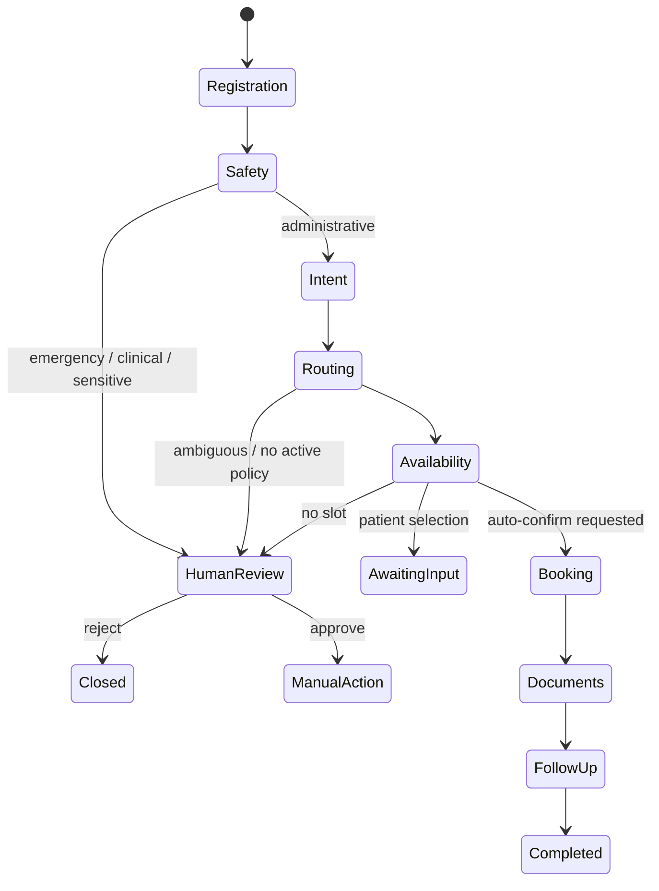

# Architecture and step outcomes

## The actual expectation

The required proof is not a chat response. It is this chain:

`UI → authenticated API → agent state graph → real domain tool → SQL commit → audit event → UI status`

The highest-value capabilities are distinct agents and state hand-offs, safety and authorization, human approval, document coordination, booking integrity, truthful confirmations, and recovery/idempotency.

## Unique design: Decision Envelopes

Each specialist produces a proposal shaped like:

```json
{
  "proposed_action": "appointment.book",
  "reason_code": "PATIENT_REQUESTED_CARDIOLOGY_FOLLOWUP",
  "evidence_refs": ["policy:routing-cardiology-followup:2026-07", "slot:12"],
  "confidence": 0.96,
  "risk_level": "standard",
  "required_scope": "appointment:write",
  "idempotency_key": "workflow-id:book:v1"
}
```

The deterministic policy gate validates actor role, patient ownership, workflow transition, risk, tool kill switch, evidence, and current target state. Only the domain service can commit.

## Implementation sequence and outcome

1. **Safety boundary** — prohibited and emergency patterns stop autonomous work. Outcome: a persisted escalation, not a clinical answer.
2. **Domain model** — relational entities and constraints preserve identity, booking, files, tasks, approvals, and lineage. Outcome: testable invariants without an LLM.
3. **Domain tools** — real reads/writes implement routing, slot search, booking, dedupe, reminder, and escalation. Outcome: every success has a committed entity ID.
4. **Policy RAG** — only active, effective policies are retrieved. Outcome: routing carries versioned evidence and no-evidence cases pause.
5. **Specialist agents** — separate prompts, responsibilities, and allowlists. Outcome: document content cannot invoke appointment mutations.
6. **Durable coordinator** — state is checkpointed after each node. Outcome: replay returns the original workflow instead of duplicating actions.
7. **MCP façade** — typed read tools wrap the same domain layer. Outcome: replaceable integration without moving authorization into the model.
8. **Patient/staff UI** — both roles call real endpoints. Outcome: reviewers can demonstrate normal and adversarial journeys without database access.
9. **Evaluation** — golden workflows, security tests, and concurrency tests gate release. Outcome: model/prompt changes are measurable.
10. **Scale** — Postgres, object storage, queue/outbox, regional deployment. Outcome: independent throughput scaling without premature microservices.

## State machine



## Data ownership

- SQL is authoritative for identity, workflow, appointment, reminder, escalation, and audit.
- Private object storage is authoritative for bytes; SQL stores ownership and checksum metadata.
- RAG is evidence, never transactional truth.
- The LLM has no credentials and receives only minimum necessary tokenized context.
- Confirmation text is composed from committed appointment rows.

